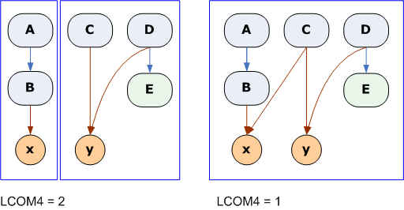

# 6. Software Architecture

## Terms

**Maintainability**: a set of attributes that bear on the effort needed to make specified modifications

**Technical Debt**

- Speeds up development
- Should _repay_ debt later (rewrite)
- Could deadlock entire org

# 7. Module Design

## Model View Controller

Associated w/Software Architecture

**model**: internal representation of info

**view**: interface that presents info to and accepts it from user

**controller**: software linking model & view

# 8. Function Design

## Lack of Cohesion of Methods (LCOM4)

- LCOM4=1 indicates a cohesive class (good)
- LCOM>=2 indicates a problem. The class should be split into smaller classes (bad)
- LCOM4=0 means no methods in class (also bad)
